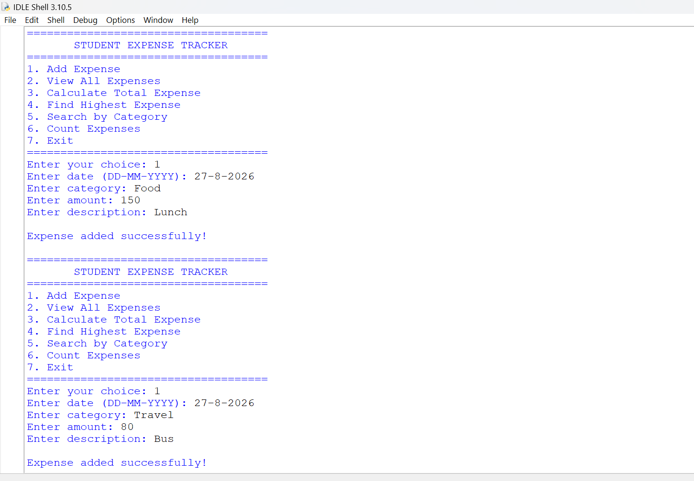
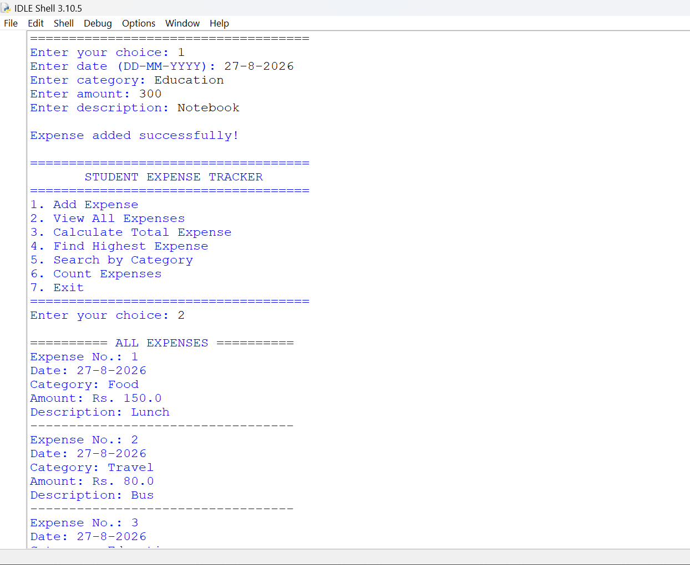
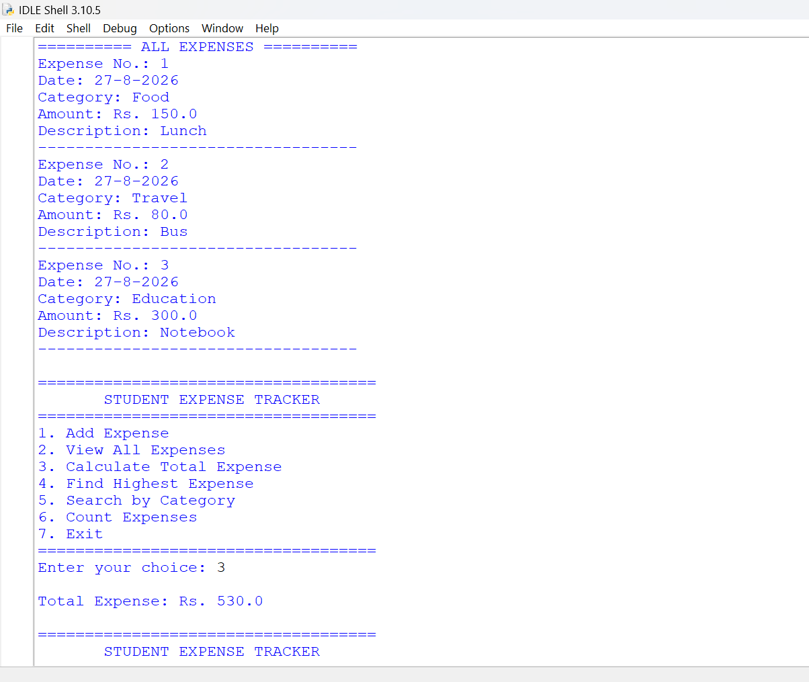
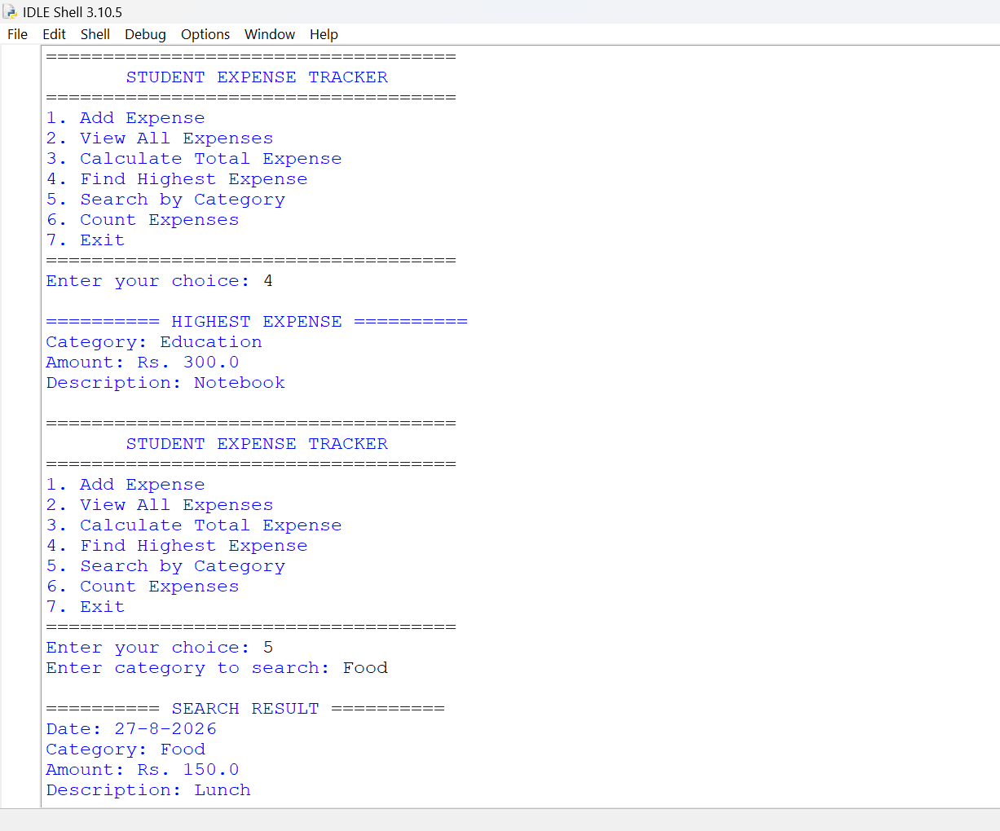
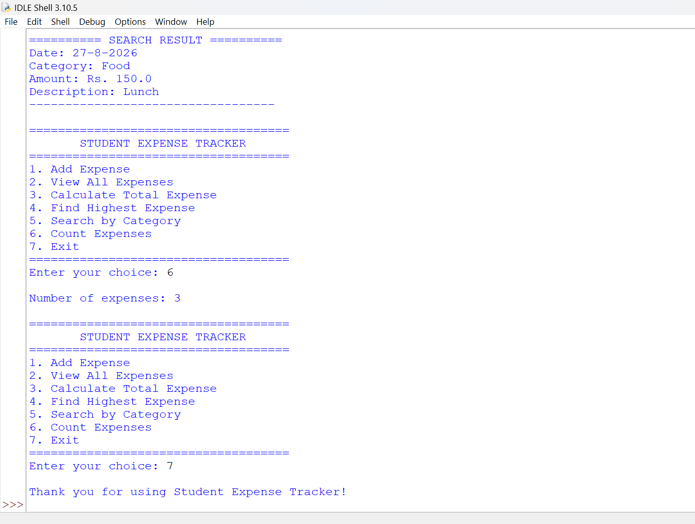

# 🧾 Student Expense Tracker

A beginner-friendly Python project designed to help students record and manage their daily expenses.

## 📌 Project Description

The Student Expense Tracker is a simple menu-driven Python application.

It allows users to add expenses, view all recorded expenses, calculate total spending, find the highest expense, search expenses by category, and count the total number of expenses.

## ✨ Features

- ➕ Add a new expense
- 📋 View all expenses
- 💰 Calculate total expenses
- 📊 Find the highest expense
- 🔍 Search expenses by category
- 🔢 Count the number of expenses
- 🚪 Exit the application

## 🛠️ Technologies Used

- Python
- Functions
- Lists
- Dictionaries
- Loops
- Conditional Statements
- User Input

## ▶️ How to Run

1. Install Python on your computer.
2. Download or clone this repository.
3. Open `student_expense_tracker.py`.
4. Run the program using Python IDLE or any Python IDE.
5. Follow the menu options shown on the screen.

## 📂 Project Structure

```text
Student-Expense-Tracker/
│
├── student_expense_tracker.py
├── output1.png
├── output2.png
├── output3.png
├── output4.png
├── output5.png
└── README.md
```


🎯 Learning Outcomes
Through this project, I learned how to use Python functions, lists, dictionaries, loops, conditional statements, user input, searching, and basic calculations to build a simple real-world application.

🚀 Future Improvements
Save expenses permanently using CSV files
Add monthly expense reports
Add graphical charts
Add a graphical user interface (GUI)
Add database support

👤 Author
Arijit Goswami


## 📸 Sample Output

The following screenshots show the program running successfully.

### Output 1


### Output 2


### Output 3


### Output 4


### Output 5

